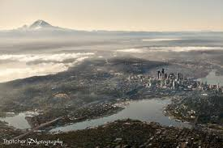
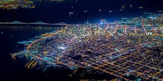
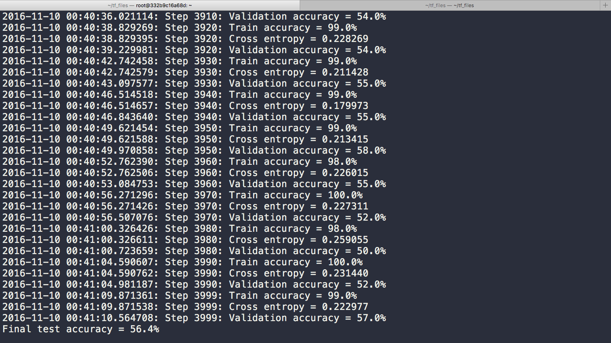
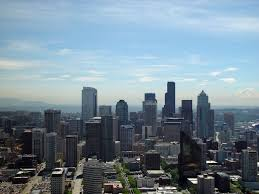
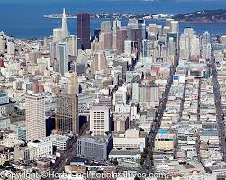
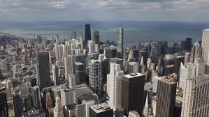
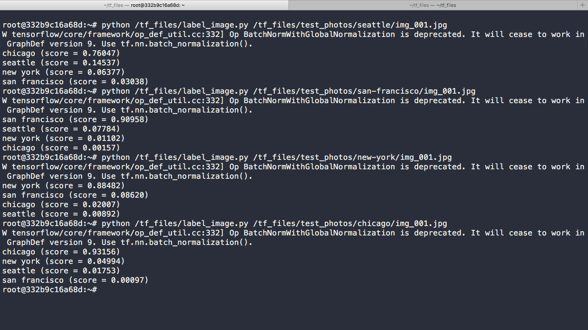

# Using TensorFlow to classify aerial views of images using deep learning.

The Last Layer of the [Inception Model](https://research.googleblog.com/2016/03/train-your-own-image-classifier-with.html) by Google is trained on hundreds of images of aerial views of major US Cities.

### Seattle

### San-Francisco

### New-York

### Chicago

### After creating bottlenecks of all the images in each city folder, I obtained a test data accuracy of 56.4%

### Upon feeding novel images of each city to the network, the network predicted the correct city 3 out of 4 times. (EXCITING!!!)

###### The network predicted Seattle incorrectly (~ 14.5% confidence)

###### The network predicted San-Francisco correctly (~91% confidence)

###### The network predicted New-York correctly (~88% confidence)

###### The network predicted Chicago correctly (~91% confidence)

### Here are the raw results.

